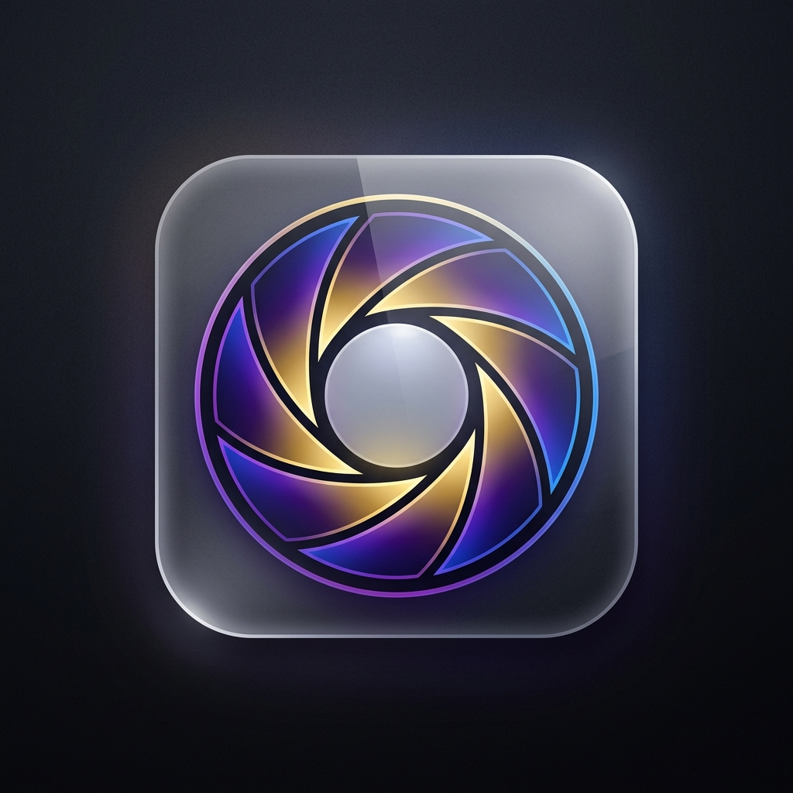

<p align="center">
  
</p>

<h1 align="center">OpenFocus</h1>

<p align="center">
  <strong>The Friendly, Private, Feature-Rich Open Source Photo Editor</strong>
</p>

<p align="center">
  <a href="#key-features">Key Features</a> •
  <a href="#technology-stack">Tech Stack</a> •
  <a href="#getting-started">Getting Started</a> •
  <a href="#mobile-optimization">Mobile Support</a> •
  <a href="#privacy--offline-first">Privacy First</a>
</p>

---

**OpenFocus** is a client-side, browser-based photo editor designed to combine high-end tools with simple, responsive usability. It runs 100% locally on your machine, requiring no registration, remote servers, or internet connection after loading. 

Whether you need a quick auto-enhance, professional filters, curved text, smart background removal, or customized watermarks, OpenFocus provides an elegant workspace on both desktop and mobile screens.

---

## 🌟 Key Features

### 🎨 Adjustment Layers & Presets
* **Slider Suite**: Control Brightness, Contrast, Highlights, Shadows, Saturation, Warmth, Tint, Clarity, Sharpness, Vignette, Blur, and Film Grain.
* **⚡ Quick Fix**: One-tap auto-enhancement adjusting lighting, shadows, and contrast distributions.
* **Presets**: Instantly switch moods with custom presets: *Soft Portrait*, *Warm Film*, *Cool Neon*, *Glamour Glow*, and *Faded Mono*.

### ✂️ Smart Selectors & Background Removal
* **Magic Brush / Magic Wand**: Select regions instantly based on color thresholds.
* **Lasso Tool**: Draw precise freehand selections to edit or isolate regions.
* **Background Remover (BGR)**: Mark foreground/keep zones and remove backgrounds securely, producing transparent PNGs with no grid residue.
* **Blur Brush**: Draw over specific areas of the photo to apply selective depth-of-field focus.

### 📝 Text & Watermark Engines
* **Custom Text Layers**: Fully customizable typography with support for letter spacing, shadows, borders, stroke widths, and weights.
* **Curved Text**: Warp text curves symmetrically (arch upwards or bowl downwards) with uniform shadow distribution.
* **Text Watermarks**: Tile customizable copyright grids across your image or drop a rotated watermark with opacity controls.

### 📐 Transformations
* **Crop Tool**: Move and resize the crop viewport with presets for custom aspect ratios ($1:1$, $4:3$, $16:9$, etc.).
* **Rotate & Flip**: Perform clockwise/counter-clockwise rotations and horizontal/vertical flips.

### 📊 Real-Time Tools
* **Live RGB Histogram**: Keep track of color distribution channels in real-time as you slide parameters.
* **Workspace History**: Complete Undo/Redo tracking up to 50 edits back.

---

## 📱 Mobile-First Optimization

OpenFocus is fully optimized to provide a native app-like experience on mobile Safari and Chrome viewports:
* **Unified Pointer Events**: Unifies mouse, touch screen, and stylus interactions into one engine.
* **Multi-Touch Gestures**: Seamlessly pinch-to-zoom and drag two fingers to pan around the canvas.
* **Overscroll Lock**: Uses viewport-level locks (`overscroll-behavior: none` and `touchmove` default preventions) to block browser-level elastic pull-to-refresh page reloads and edge history swipe-back gestures.
* **Ergonomic Safe Zones**: The bottom menu bar is padded away from iPhone/Android home indicators to prevent accidental system gesture triggers.
* **Smart Memory Limits**: Automatically downscales high-resolution camera images to a max dimension of `2048px` on mobile, preventing WebKit GPU memory process crashes while keeping editing smooth and snappy.

---

## 🛠 Technology Stack

OpenFocus is built to be lightweight, zero-dependency, and extremely fast:
* **Core Logic**: Pure Vanilla JavaScript (ES6+), HTML5 Canvas, and Context 2D APIs.
* **Styling**: Vanilla CSS3 with Custom Properties (variables) for dark mode theme matching and fluid Glassmorphic blur effects.
* **Database**: Local workspace states are saved locally on the client machine using **IndexedDB**.
* **Offline PWA Support**: Registered Service Worker (`sw.js`) and `manifest.json` configuration for offline capabilities and stand-alone home screen installation.

---

## 🚀 Getting Started

Since OpenFocus is a client-side web application, running it locally is incredibly simple:

1. Clone or download this directory:
   ```bash
   git clone https://github.com/your-username/open-focus.git
   cd open-focus
   ```
2. Simply double-click `index.html` to run it directly in your browser, or spin up a simple local server:
   ```bash
   # Python 3
   python3 -m http.server 8000
   
   # Node/NPM
   npx serve .
   ```
3. Open `http://localhost:8000` (or the server port provided) in your browser.

---

## 🛡 Privacy & Offline-First

Your data is yours. OpenFocus performs all image processing, pixel manipulations, and file exports locally in your browser's sandboxed environment.
* **No Server Uploads**: Images are read using the `FileReader` API locally. Nothing is ever sent to a remote backend.
* **No Analytics**: Zero tracking scripts, ads, or third-party cookies.
* **IndexedDB Local Storage**: Workspace recovery data stays safe in your browser's local sandbox storage.
